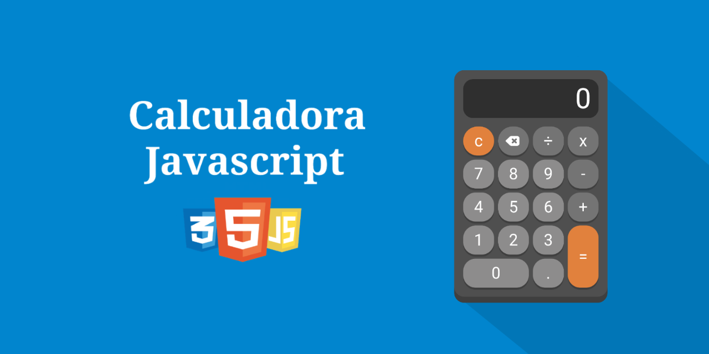

# 🧮 Calculadora

Calculadora web simples com HTML, CSS e JavaScript - projeto de estudos da Alura.




## 📑 Sumário

- [Sobre](#sobre)
- [Funcionalidades](#funcionalidades)
- [Tecnologias](#tecnologias)
- [Como executar](#como-executar)
- [Estrutura](#estrutura)
- [Acessibilidade](#acessibilidade)
- [Licença](#licença)

## 📖 Sobre

Calculadora com display somente-leitura, botões numéricos e operadores (`+ − x ÷`), além de limpar (`C`), apagar e igual (`=`). Foco em manipulação de eventos e DOM.

## ✨ Funcionalidades

- Operações básicas: soma, subtração, multiplicação, divisão
- Botão `C` limpa, backspace apaga um dígito
- Display `readonly` com `aria-label`
- Ícones sociais no topo (GitHub / LinkedIn)

## 🛠️ Tecnologias

- HTML5
- CSS3
- JavaScript (`script.js`)

## 🚀 Como executar

```bash
git clone https://github.com/VictorHFL/Calculadora.git
cd Calculadora
# abra index.html no navegador
```

> [!TIP]
> Se `Imagens/Preview.png` não carregar, confira o nome da pasta (`Imagens` com I maiúsculo).

## 📁 Estrutura

```text
Calculadora/
├── index.html
├── style.css
├── script.js
├── Imagens/
└── README.md
```

## ♿ Acessibilidade

- Botões com `aria-label` ("Ir para o GitHub", "Valor da Calculadora")
- Contraste e áreas de toque adequadas para uso com teclado e leitor de tela

## 📄 Licença

Distribuído sob a licença MIT. Veja [LICENSE](LICENSE) para detalhes.

